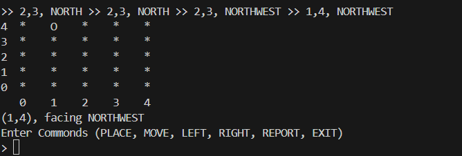

# Context

This solution is built on requirement by the [questions guideline](./QUESTION.MD#description).

# Getting Started

## Node.js

The solution requires `Node.js` to execute.

You may check your `Node.js` existance by running the command on your terminal/CMD

> node -v

then

> npm -v

> [!TIP]
> If you haven't so, you may head to [their official website](https://nodejs.org/en/download/)

### Running the solution

After both were installed, navigate to same level as this README is, run the following

> npm run start

You shall be greeted with the starting of the project.

```
> seek-robot-challenge@1.0.0 start
> node app.js
> Enter Commonds (PLACE, MOVE, LEFT, RIGHT, REPORT, EXIT)
```

## Using the solution

This solution would allow user to input from a range of commands,

- PLACE
- MOVE
- LEFT
- RIGHT
- REPORT
- EXIT
- PLAIN

### Setting up

This solution repo defaults the board dimension to 5 x 5, to easily manage the dimension, navigate to [model/robot-model.js](./model/board-model.js) and declare the desired dimension at line 6.

This solution also assume each movement progression at 1 step per move, to make a difference, you may refer to [app.js](./app.js)

As the program takes the input and uppercase it, you may disregard capital cases when giving commands to the program.

### PLACE

`PLACE` command allows user to declare a coordinate to start off.
User should declare the command like below

> PLACE x(number),y(number),Orientation(string)

doing so initiates/resets the robot's initial coordinate on the board and is recommended to be the very first of users' array of commands.

### MOVE

`MOVE` would let the robot move towards the `Orientation` it is currently into.

> MOVE

### LEFT/RIGHT

`LEFT` or `RIGHT` would turn the Orientation of the robot 90 degree anti-clockwise and clockwise respectively. Note that the Orientation of the robot would be the current Orientation e.g. if it is facing WEST, command it to `RIGHT` will make it face North.

> LEFT / RIGHT

> [!TIP]
> This program also handles half-turn, supporting 8 directions and you can put `LEFT HALF` or `RIGHT HALF` to achive so, with this the robot's orientation will turn 45 degree instead of 90.

### REPORT

This feature act as an execution breakpoint which will execute the stored sequence of tasks accumulated, and as result, if the robot was initiated correctly, user should see table of coordinates with the current robot tagged like below. 

From the attached screenshot, user can expect to see the flow of valid movements & orientations, and the final current location & orientation the robot is in at the end of execution, user can still proceed with more commands as long as the program is not exited.

> REPORT

### EXIT

`EXIT` will allow user to exit the program. As this solution does not use any persistance memory, the progress will lost upon exit. To rerun the program, kindly follow the guide [above](#running-the-solution)
